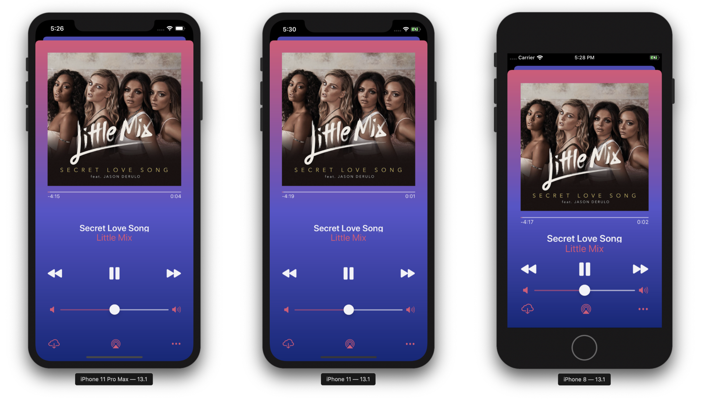

# My Music Story
It was originally made as a music player but later modified to become a hub of multiple channels, allowing user to get the latest Instagram posts and the most populart songs of Taylor Swift.
 
The latest version consists of two parts: music player and Instagram.
 
Music play is an imitation of Apple Music App, having full playing functions. Instagram part is an imitation of Instagram, able to display user profile and latest pictures. It goes to the full post (including post description, post time, and number of likes) when clicking a picture, like current Intagram does.
 
<ul>
<li>Fit the screen sizes of iPhone SE and later</li>
<li>Play music, including shuffle, next, previous, pause, start, and auto play the next one functions</li>
<li>Play music that is stored in the app</li>
<li>Get music list and play music through iTune API</li>
<li>Get Instagram posts and user info through Instagram API</li>
<li>Go to the exact post user click</li>
</ul>
 
For more details about this app, please see Medium articles:
[Music App #1 Stack View, Auto Layout](https://medium.com/%E5%BD%BC%E5%BE%97%E6%BD%98%E7%9A%84-swift-ios-app-%E9%96%8B%E7%99%BC%E6%95%99%E5%AE%A4/swift-%E7%B7%B4%E7%BF%92-music-app-1-stack-view-auto-layout-d6b5aa649a74)
[Music App #2 AVPlayer](https://medium.com/%E5%BD%BC%E5%BE%97%E6%BD%98%E7%9A%84-swift-ios-app-%E9%96%8B%E7%99%BC%E6%95%99%E5%AE%A4/swift-%E7%B7%B4%E7%BF%92-music-app-2-avplayer-fa6f6d37c94d)
[Music App #3 JSON, Codable, Instagram API](https://medium.com/%E5%BD%BC%E5%BE%97%E6%BD%98%E7%9A%84-swift-ios-app-%E9%96%8B%E7%99%BC%E6%95%99%E5%AE%A4/swift-%E7%B7%B4%E7%BF%92-music-app-3-json-codable-instagram-api-f5cba773e17c)
[Music App #4 iTune API, Model(MVC), @escaping](https://medium.com/%E5%BD%BC%E5%BE%97%E6%BD%98%E7%9A%84-swift-ios-app-%E9%96%8B%E7%99%BC%E6%95%99%E5%AE%A4/swift-%E7%B7%B4%E7%BF%92-music-app-4-itune-api-model-mvc-883b0a1a4427)
[Music App #5 Result Type, Error Handling](https://medium.com/%E5%BD%BC%E5%BE%97%E6%BD%98%E7%9A%84-swift-ios-app-%E9%96%8B%E7%99%BC%E6%95%99%E5%AE%A4/swift-%E7%B7%B4%E7%BF%92-music-app-5-result-type-error-handling-56a9597a5945)
[Music App #6 Collection View, Table View scrollToRow, Navigation Bar Colour](https://medium.com/%E5%BD%BC%E5%BE%97%E6%BD%98%E7%9A%84-swift-ios-app-%E9%96%8B%E7%99%BC%E6%95%99%E5%AE%A4/swift-%E7%B7%B4%E7%BF%92-music-app-6-collection-view-table-view-scrolltorow-4ea6e4c39850)

 
<h1 class="code-line" data-line-start=0 data-line-end=1 >Demo</h1>
<h3 class="code-line" data-line-start=1 data-line-end=2 >Instagram</h3>

<h3 class="code-line" data-line-start=3 data-line-end=4 >iTune</h3>

<h3 class="code-line" data-line-start=5 data-line-end=6 >Different Screen Sizes</h3>

